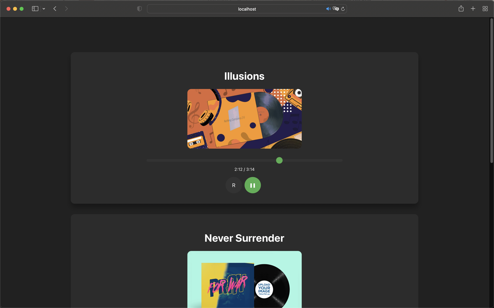

# Music Player App

This is a template to build a simple music player app with ReactJS. The app allows you to play multiple audio tracks, pause/resume playback, and restart a track. See the finished version [here](https://github.com/antoinekllee/react-audio-player).



## Features

- Play multiple audio tracks
- Pause/Resume playback
- Restart a track
- Show track progress and duration

## Getting Started

These instructions will get you a copy of the project up and running on your local machine for development and testing purposes.

### Prerequisites

- [Node.js](https://nodejs.org/en/)
- [npm](https://www.npmjs.com/get-npm)

### Installing

1. Clone this repository:

```
git clone https://github.com/antoinekllee/react-audio-player-template.git
```

2. Navigate to the project directory:

```
cd react-audio-player-template
```

3. Install the required dependencies:

```
npm install
```

4. Start the development server:

```
npm start
```

Now, open your browser and visit `http://localhost:3000` to see the app in action.

## How to Use

To add more tracks to the app, modify the `data` array in `App.js`:

```javascript
const data = [
  {
    title: "Track Title",
    audioPath: "/assets/music/Track.mp3",
    imagePath: "/assets/music/TrackCover.jpg"
  },
  // More tracks here...
];
```

Make sure to put the corresponding audio and image files in the `public/assets/music` directory.

## Built With

- [React](https://reactjs.org/) - A JavaScript library for building user interfaces